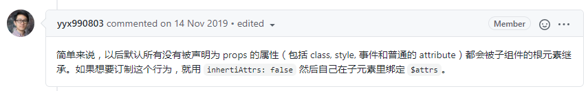

# vue3-project

# vue3.0 项目

## 修改

### stylelint
- 引入 `stylelint-config-rational-order`，不用自己再写顺序规范


## 遇到的问题
#### scss遇到calc变量的问题
[解决问题方法](https://www.jianshu.com/p/399dde3763c9)
```css
.entrance-page {
    height: calc(100% - $appFooterHeight);
}
```
应该使用下面写法
```css
.entrance-page {
    height: calc(100% - #{$appFooterHeight});
}
```


#### iphone不触发:active的问题
第1种方法: document.addEventListener('touchstart', () => {});
```js
document.addEventListener('touchstart', () => { /* empty */ });
```

第2种方法：在<body>标签写ontouchstart
```html
<body ontouchstart>
    <div id="app"></div>
</body>
```

这里采用第2种写法


## vue3 v-model的自定义实现
支持多个属性绑定v-model


## vue3 transiton组件命名的更改
以前是 `v-enter` -> `v-enter-active` -> `v-enter-to`

改为是 `v-enter-from` -> `v-enter-active` -> `v-enter-to`


## `transition` 和 `keep-alive`等不能写在 `router-view` 外面
以前是
```vue
<transition>
    <router-view></router-view>
</transition>
```

改为
```vue
<router-view v-slot="{ Component }">
    <transition>
        <component :is="Component"></component>
    </transition>
</router-view>
```

`keep-alive`类似

## $attrs
在vue2中表示非props的属性

在vue3中表示非子组件声明好的prop和事件，即包括了vue2中的$attr和$listeners

## inheritAttrs会影响class等属性
```vue
<m-button class="mt-30">主要按钮111</m-button>
```
在vue2.0中，即使加了`inheritAttrs:false`，class会自动加到子级上，到了vue3就不会了

[解答](https://github.com/vuejs/vue-next/pull/457)




## vue-router配置404页面
在vue2中，用下面的写法
```js
{
    path: "*", // 此处需特别注意置于最底部
    component: () => import('../pages/error/404.vue')
}
```

在vue3中，要用下面的写法
```js
{
    path: '/:pathMatch(.*)', // 可以在任何位置
    component: () => import('../pages/error/404.vue')
},
```
如果使用
```js
{
    path: '/:pathMatch(.*)', // 配置404
    redirect: '/error/notFound'
}
```
会提示`{Vue Router warn]: Path "/error/notFound" was passed with params but they will be ignored. Use a named route alongside params instead.`

暂未找到对应解决方法


# 当使用虚拟节点或者非根组件的时候

emits事件不支持中横线，需要写成驼峰，否则会报错
```
Extraneous non-emits event listeners (closeToast) were passed to component but could not be automatically inherited because component renders fragment or text root nodes. If the listener is intended to be a component custom event listener only, declare it using the "emits" option. 
```

这个是vue的bug，[记录](https://github.com/vuejs/vue-next/pull/2542)，当前vue版本3.0.3


# ::v-deep
`::v-deep` 改为 `::v-deep(.className)`

https://zhuanlan.zhihu.com/p/143048528


# 过滤器移除
https://v3.vuejs.org/guide/migration/filters.html

过滤器被移除，推荐使用计算属性或者方法来实现


# props自动推导
props会自动推导，遇到复杂的类型时候，就推导不出
```vue
props: {
    filedLabelName: { type: String, default: 'text' },
} 
```
上面能自动推导出 `filedLabelName` 为字符串

但是一旦遇到复杂的类型，就会推导出any

```vue
props: {
    filedLabelName: { type: String, default: 'text' },
    list: { type: Array as PropType<ItemType[]>, default () { return [];} }
} 
```
推导出 `filedLabelName` 为any

如果设置默认值的时候，用箭头函数又没有问题了
```vue
props: {
    filedLabelName: { type: String, default: 'text' },
    list: { type: Array as PropType<ItemType[]>, default: () => [] }
}
```
又或者默认值写为undefined
```vue
list: { type: Array as PropType<ItemType[]>, default: undefined }
```
